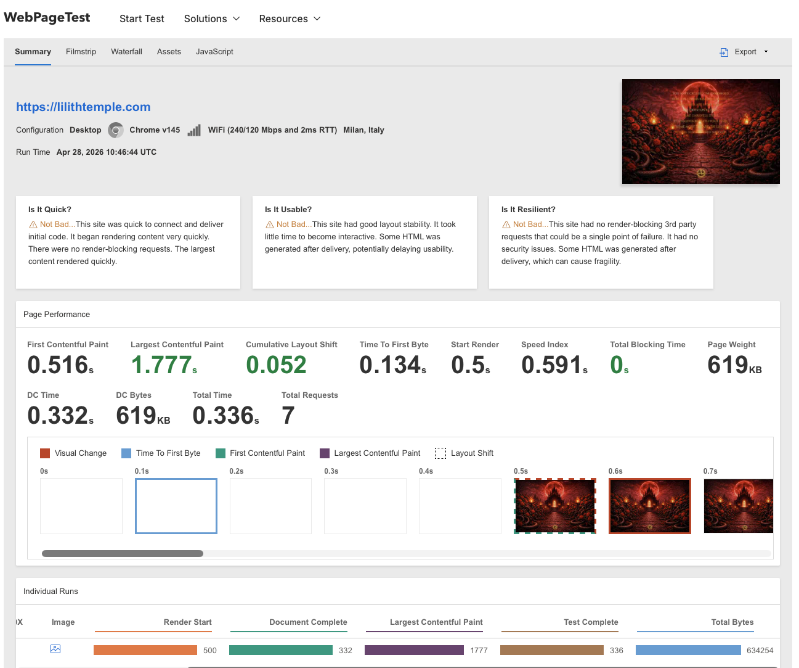
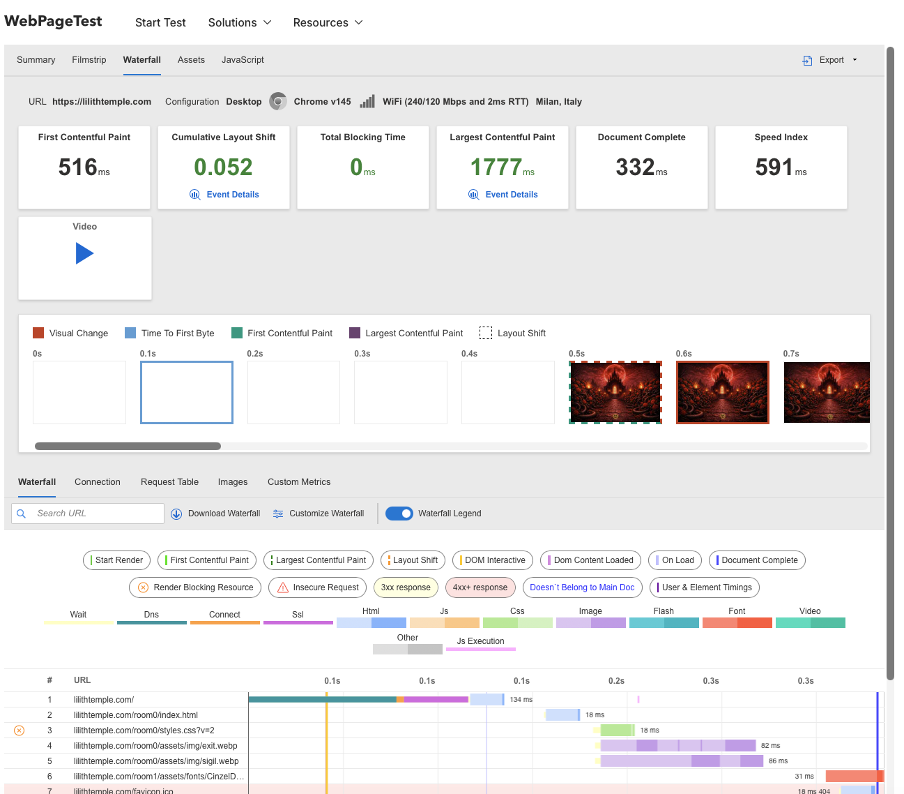
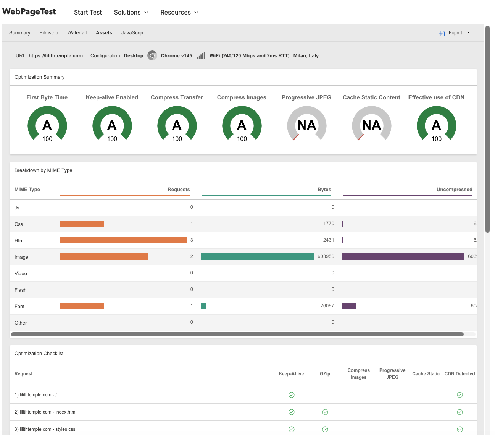
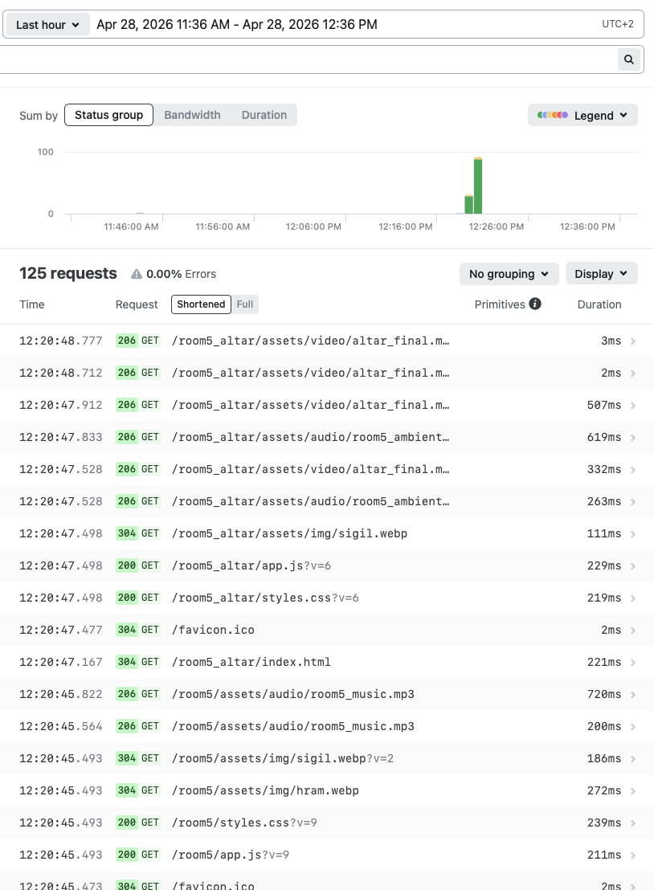

# ⚡ Performance Optimization — Lilith Temple

## 🔹 Target
https://lilithtemple.com

---

## 🔹 Project Context

This project is a **frontend-heavy artistic web experience**, focused on:

- immersive visuals  
- video and audio atmosphere  
- cinematic presentation  

The main challenge:

> Maintain visual richness while achieving fast and stable performance

---

## 🔹 Initial State

- Total size: ~460 MB  
- Heavy video assets  
- High loading time  
- Potential UX issues on slower networks  

---

## 🔧 Optimization Approach

The optimization focused on balancing **visual quality** and **performance efficiency**.

### Actions performed:

- Video compression (significant size reduction with minimal quality loss)  
- Removal of unused assets  
- Static resource restructuring  
- CDN delivery via Netlify  
- Improved loading behavior  

---

## 📊 Performance Results

### 🟢 Core Metrics

- First Contentful Paint (FCP): **0.516s**  
- Largest Contentful Paint (LCP): **1.777s**  
- Total Blocking Time (TBT): **0 ms**  
- Cumulative Layout Shift (CLS): **0.052**  
- Page Weight: **~619 KB**  
- Total Requests: **7**

---

### 📌 Interpretation

- FCP < 1s → very fast initial rendering  
- LCP < 2.5s → good perceived load speed  
- TBT = 0 → no main thread blocking  
- CLS < 0.1 → stable layout (no visual jumps)  

👉 Overall:

**High performance despite media-heavy design**

---

## 🟢 Resource Loading (Waterfall)

### Key Observations:

- No critical render-blocking resources  
- Efficient loading sequence  
- Fast initial rendering phase  

---

## 🟢 Optimization Score

### Highlights:

- Compression: ✅  
- Keep-alive: ✅  
- CDN usage: ✅  
- Overall grade: **A (100)**  

---

## 🟢 Network Behavior

### Observations:

- Static architecture (no backend overhead)  
- Minimal number of requests  
- Efficient asset delivery via CDN  

---

## ⚠️ Observed Issues

- Missing favicon (404 request)  
- Minor CSS render-blocking behavior  

👉 Impact: minimal, does not significantly affect UX

---

## 📉 Final Result

- Reduced size from **~460 MB → ~70 MB**  
- Significant performance improvement  
- Stable behavior across devices and networks  

---

## 📸 Evidence

### Performance Summary

### Waterfall Analysis

### Optimization Score

### Network Requests

---

## 🧠 Key Insight

This project demonstrates how architectural decisions impact performance:

- Static architecture → predictable behavior  
- No backend → minimal overhead  
- Optimized media → controlled user experience  

---

## ✅ Conclusion

Despite being a **media-rich artistic project**, the application achieves:

- Fast rendering  
- Stable layout  
- Efficient resource loading  

👉 Performance level: **HIGH**

---

## 🧠 Author Note

This project is not a typical commercial application.

It is a **creative technical experiment**, combining:

- visual storytelling  
- frontend engineering  
- performance optimization  

---