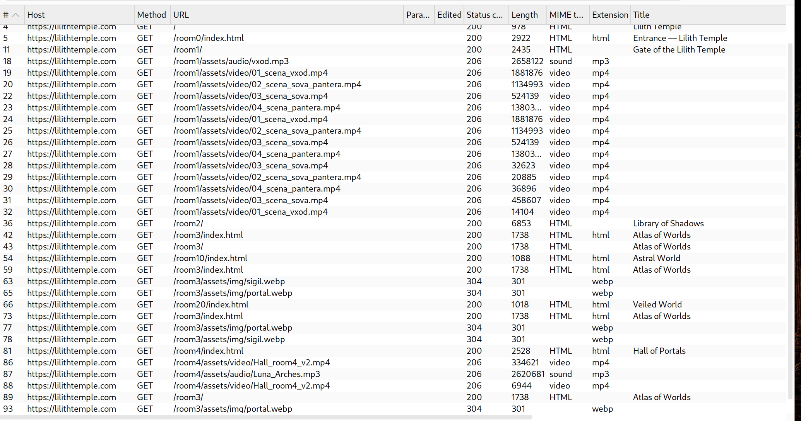
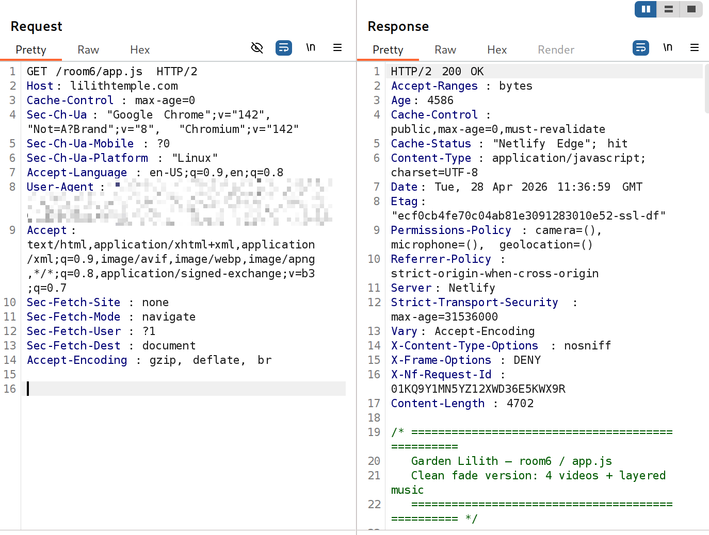
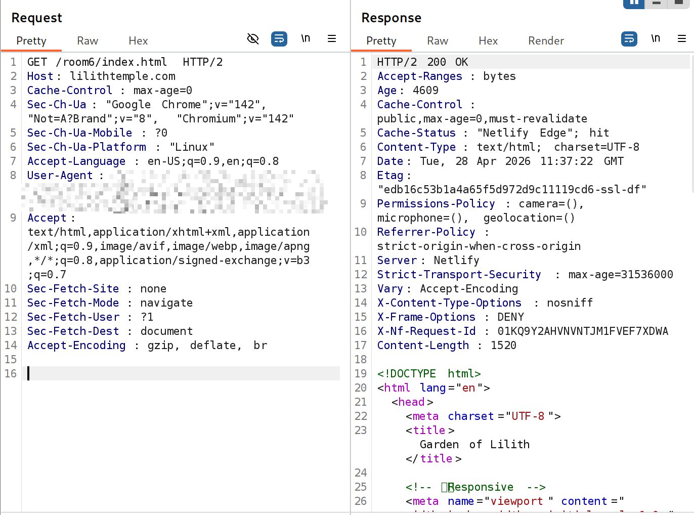
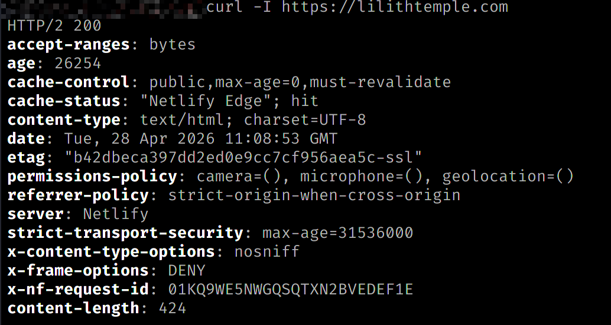

# 🛡 Security Assessment — Lilith Temple

## 🔹 Target
https://lilithtemple.com

## 🔹 Scope
Client-side web application (static architecture)

---

## 🔍 Methodology

- Manual testing (browser + DevTools)
- Burp Suite (interception & traffic analysis)
- curl (HTTP headers inspection)

---

## 🔎 Network Traffic Analysis

### 📸 Burp Suite — HTTP History

Observations:
- Only GET requests were observed
- No POST / PUT / DELETE methods detected
- No API endpoints identified
- All resources are static (HTML, CSS, JS, media)

---

### 📸 Burp Suite — JavaScript Request

Observations:
- JavaScript is client-side only
- No sensitive logic or secrets exposed

---

### 📸 Burp Suite — HTML Response

Observations:
- Static HTML pages
- No dynamic rendering or backend interaction

---

## 🔐 HTTP Security Headers

### 📸 curl Headers

Observations:
- Strict-Transport-Security enabled
- X-Frame-Options: DENY
- X-Content-Type-Options: nosniff
- Referrer-Policy configured
- Permissions-Policy restricts device access

---

## ⚠️ Attack Surface Analysis

- No authentication mechanisms
- No user input fields
- No backend API
- No session handling

➡️ Result: Minimal attack surface

---

## ⚠️ Potential Risks

- Heavy frontend may impact performance under weak networks
- Large media files could be abused for resource exhaustion (DoS-like scenarios)

---

## ✅ Conclusion

The application was assessed from an external attacker perspective without prior assumptions.

- Static architecture significantly reduces risk
- No exploitable input vectors identified
- No backend attack surface present

**Security Risk Level: LOW**

---

## 🧠 Key Insight

This project demonstrates how architectural decisions (static frontend vs dynamic backend) directly impact the security posture of an application.
